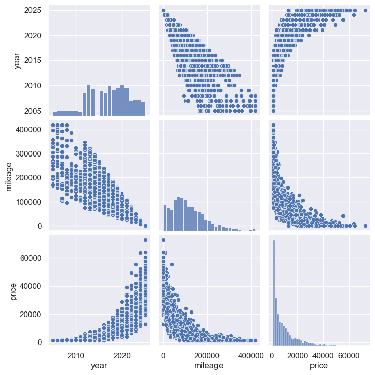
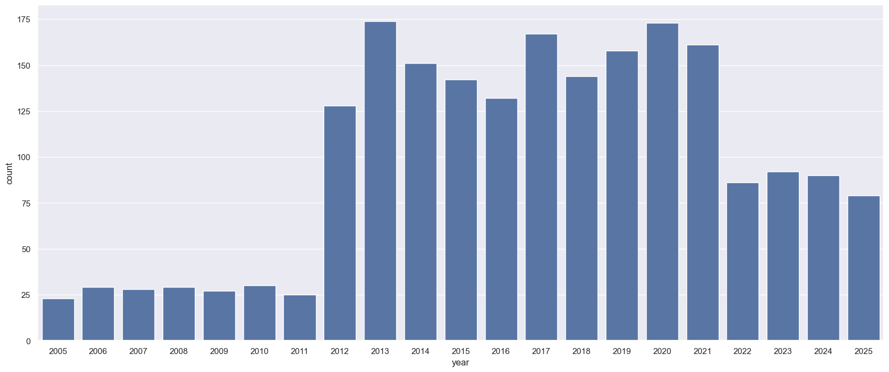
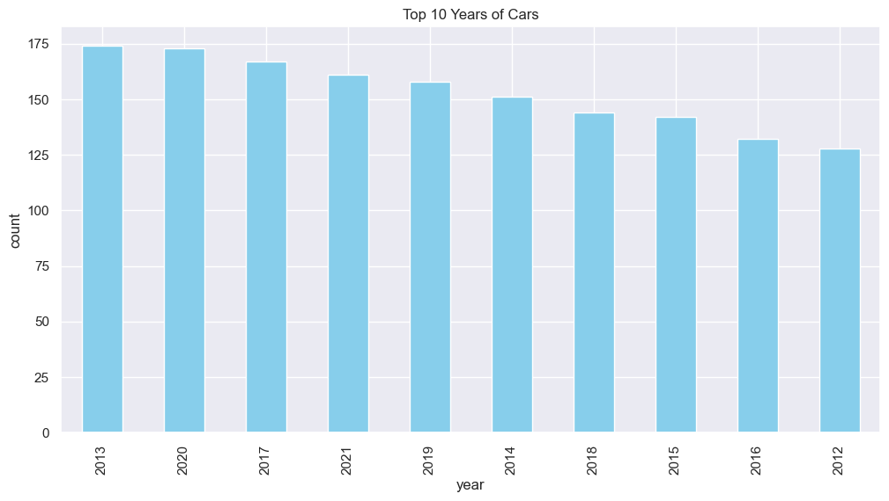
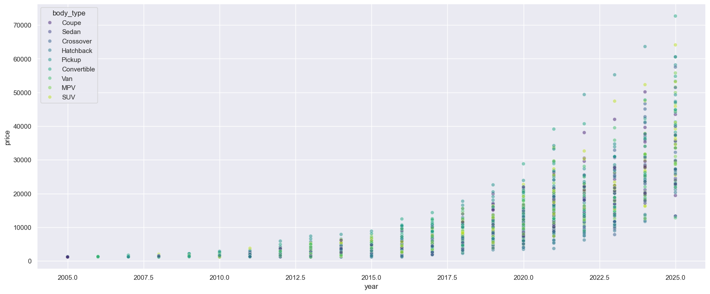
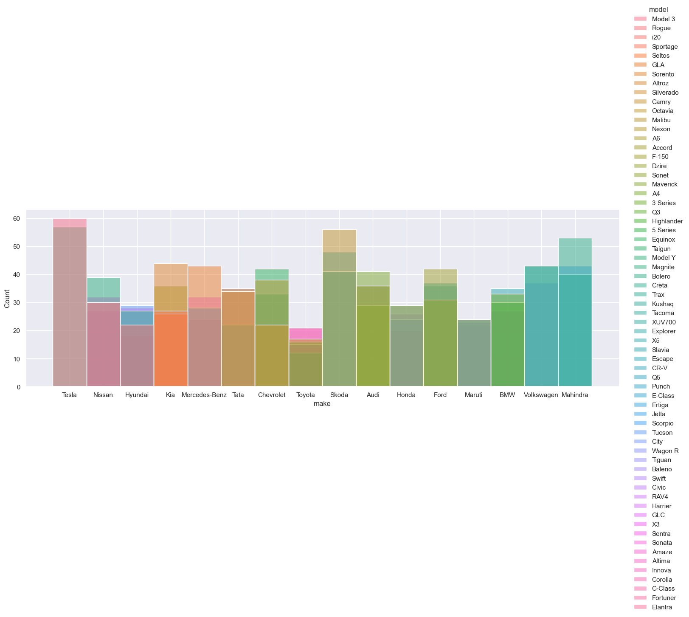
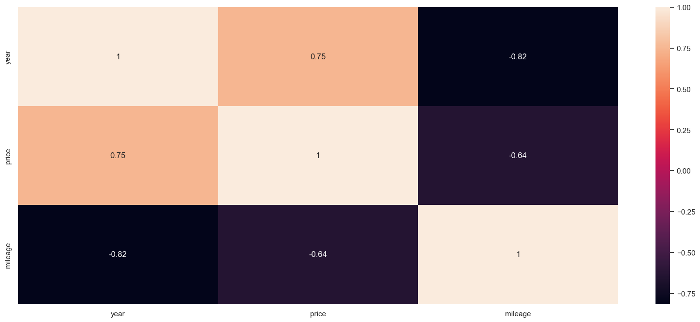

```python
#Car Sales
#Link to source: https://www.kaggle.com/datasets/pratyushpuri/used-car-sales-listings-dataset-2025
```


```python
import pandas as pd
import numpy as np
import matplotlib.pyplot as plt
import seaborn as sns
pd.set_option('display.max_columns', None)
```


```python
df = pd.read_csv("data/used_car_listings.csv")
```


```python
df.head()
```


<div>
<style scoped>
    .dataframe tbody tr th:only-of-type {
        vertical-align: middle;
    }

    .dataframe tbody tr th {
        vertical-align: top;
    }

    .dataframe thead th {
        text-align: right;
    }
</style>
<table border="1" class="dataframe">
  <thead>
    <tr style="text-align: right;">
      <th></th>
      <th>listing_id</th>
      <th>vin</th>
      <th>make</th>
      <th>model</th>
      <th>year</th>
      <th>trim</th>
      <th>body_type</th>
      <th>fuel_type</th>
      <th>transmission</th>
      <th>mileage</th>
      <th>price</th>
      <th>condition</th>
      <th>location</th>
      <th>seller_type</th>
      <th>features</th>
    </tr>
  </thead>
  <tbody>
    <tr>
      <th>0</th>
      <td>1</td>
      <td>9M6LF68V634LY2252</td>
      <td>Tesla</td>
      <td>Model 3</td>
      <td>2019</td>
      <td>NaN</td>
      <td>Coupe</td>
      <td>Electric</td>
      <td>Manual</td>
      <td>46134</td>
      <td>19919.0</td>
      <td>good</td>
      <td>New Lindsey, GA, US</td>
      <td>Dealer</td>
      <td>Alloy Wheels, Android Auto, Apple CarPlay, Fog...</td>
    </tr>
    <tr>
      <th>1</th>
      <td>2</td>
      <td>1S0ZCY536BSCY2864</td>
      <td>Nissan</td>
      <td>Rogue</td>
      <td>2024</td>
      <td>LT</td>
      <td>Sedan</td>
      <td>Hybrid</td>
      <td>Automatic</td>
      <td>16109</td>
      <td>19480.0</td>
      <td>good</td>
      <td>Pughtown, CO, US</td>
      <td>Dealer</td>
      <td>Alloy Wheels, Android Auto, Lane Keep Assist, ...</td>
    </tr>
    <tr>
      <th>2</th>
      <td>3</td>
      <td>YFB625BN0RTMZ5590</td>
      <td>Hyundai</td>
      <td>i20</td>
      <td>2018</td>
      <td>XLE</td>
      <td>Crossover</td>
      <td>Petrol</td>
      <td>Automatic</td>
      <td>173239</td>
      <td>4556.0</td>
      <td>good</td>
      <td>Satna, HR, India</td>
      <td>Dealer</td>
      <td>Alloy Wheels, Bluetooth, Panoramic Roof, Sunroof</td>
    </tr>
    <tr>
      <th>3</th>
      <td>4</td>
      <td>CPMZ4RFN5WYL37096</td>
      <td>Kia</td>
      <td>Sportage</td>
      <td>2023</td>
      <td>EX</td>
      <td>Hatchback</td>
      <td>Diesel</td>
      <td>CVT</td>
      <td>36810</td>
      <td>11536.0</td>
      <td>fair</td>
      <td>山武市, Osaka, Japan</td>
      <td>Certified Pre-Owned</td>
      <td>Alloy Wheels, Bluetooth, Keyless Entry, Naviga...</td>
    </tr>
    <tr>
      <th>4</th>
      <td>5</td>
      <td>4PJZG3MV6D9365673</td>
      <td>Kia</td>
      <td>Seltos</td>
      <td>2020</td>
      <td>Trend</td>
      <td>Pickup</td>
      <td>Diesel</td>
      <td>Automatic</td>
      <td>87749</td>
      <td>14098.0</td>
      <td>good</td>
      <td>長生郡長生村, Osaka, Japan</td>
      <td>Certified Pre-Owned</td>
      <td>Apple CarPlay, Backup Camera, Bluetooth, Heate...</td>
    </tr>
  </tbody>
</table>
</div>


```python
df.columns

```


    Index(['listing_id', 'vin', 'make', 'model', 'year', 'trim', 'body_type',
           'fuel_type', 'transmission', 'mileage', 'price', 'condition',
           'location', 'seller_type', 'features'],
          dtype='object')


```python
#Checking if we have duplicated vins 
df.duplicated('vin').sum()
```


    0


```python
df = df[[#'listing_id', 'vin', 
    'make', 'model',
    'year', 'trim', 'body_type',
    'fuel_type', 'transmission', 'mileage', 'price', 'condition',
    'location', 'seller_type', 'features']].copy()

df.shape
```


    (2068, 13)


```python
df.dtypes
```


    make             object
    model            object
    year              int64
    trim             object
    body_type        object
    fuel_type        object
    transmission     object
    mileage           int64
    price           float64
    condition        object
    location         object
    seller_type      object
    features         object
    dtype: object


```python
df.describe()
```


<div>
<style scoped>
    .dataframe tbody tr th:only-of-type {
        vertical-align: middle;
    }

    .dataframe tbody tr th {
        vertical-align: top;
    }

    .dataframe thead th {
        text-align: right;
    }
</style>
<table border="1" class="dataframe">
  <thead>
    <tr style="text-align: right;">
      <th></th>
      <th>year</th>
      <th>mileage</th>
      <th>price</th>
    </tr>
  </thead>
  <tbody>
    <tr>
      <th>count</th>
      <td>2068.000000</td>
      <td>2068.000000</td>
      <td>2068.000000</td>
    </tr>
    <tr>
      <th>mean</th>
      <td>2016.975822</td>
      <td>115626.364603</td>
      <td>9182.621857</td>
    </tr>
    <tr>
      <th>std</th>
      <td>4.610981</td>
      <td>80971.112603</td>
      <td>9964.093618</td>
    </tr>
    <tr>
      <th>min</th>
      <td>2005.000000</td>
      <td>0.000000</td>
      <td>1140.000000</td>
    </tr>
    <tr>
      <th>25%</th>
      <td>2014.000000</td>
      <td>57683.250000</td>
      <td>2323.750000</td>
    </tr>
    <tr>
      <th>50%</th>
      <td>2017.000000</td>
      <td>99212.000000</td>
      <td>5448.500000</td>
    </tr>
    <tr>
      <th>75%</th>
      <td>2020.000000</td>
      <td>159291.500000</td>
      <td>11946.750000</td>
    </tr>
    <tr>
      <th>max</th>
      <td>2025.000000</td>
      <td>418428.000000</td>
      <td>72641.000000</td>
    </tr>
  </tbody>
</table>
</div>


```python
sns.pairplot((df))
```


    <seaborn.axisgrid.PairGrid at 0x22755506360>


    

    


```python
df.isna().sum()
```


    make              0
    model             0
    year              0
    trim            244
    body_type         0
    fuel_type         0
    transmission      0
    mileage           0
    price             0
    condition        46
    location          0
    seller_type       0
    features        151
    dtype: int64


```python
df.loc[df.duplicated()]
```


<div>
<style scoped>
    .dataframe tbody tr th:only-of-type {
        vertical-align: middle;
    }

    .dataframe tbody tr th {
        vertical-align: top;
    }

    .dataframe thead th {
        text-align: right;
    }
</style>
<table border="1" class="dataframe">
  <thead>
    <tr style="text-align: right;">
      <th></th>
      <th>make</th>
      <th>model</th>
      <th>year</th>
      <th>trim</th>
      <th>body_type</th>
      <th>fuel_type</th>
      <th>transmission</th>
      <th>mileage</th>
      <th>price</th>
      <th>condition</th>
      <th>location</th>
      <th>seller_type</th>
      <th>features</th>
    </tr>
  </thead>
  <tbody>
  </tbody>
</table>
</div>


```python
df['year'].value_counts()
```


    year
    2013    174
    2020    173
    2017    167
    2021    161
    2019    158
    2014    151
    2018    144
    2015    142
    2016    132
    2012    128
    2023     92
    2024     90
    2022     86
    2025     79
    2010     30
    2006     29
    2008     29
    2007     28
    2009     27
    2011     25
    2005     23
    Name: count, dtype: int64


```python
df['year'].value_counts()
```


    year
    2013    174
    2020    173
    2017    167
    2021    161
    2019    158
    2014    151
    2018    144
    2015    142
    2016    132
    2012    128
    2023     92
    2024     90
    2022     86
    2025     79
    2010     30
    2006     29
    2008     29
    2007     28
    2009     27
    2011     25
    2005     23
    Name: count, dtype: int64


```python
sns.countplot(x="year", data=df)  
```


    <Axes: xlabel='year', ylabel='count'>


    

    


```python
df.query("year>2012")
```


<div>
<style scoped>
    .dataframe tbody tr th:only-of-type {
        vertical-align: middle;
    }

    .dataframe tbody tr th {
        vertical-align: top;
    }

    .dataframe thead th {
        text-align: right;
    }
</style>
<table border="1" class="dataframe">
  <thead>
    <tr style="text-align: right;">
      <th></th>
      <th>make</th>
      <th>model</th>
      <th>year</th>
      <th>trim</th>
      <th>body_type</th>
      <th>fuel_type</th>
      <th>transmission</th>
      <th>mileage</th>
      <th>price</th>
      <th>condition</th>
      <th>location</th>
      <th>seller_type</th>
      <th>features</th>
    </tr>
  </thead>
  <tbody>
    <tr>
      <th>0</th>
      <td>Tesla</td>
      <td>Model 3</td>
      <td>2019</td>
      <td>NaN</td>
      <td>Coupe</td>
      <td>Electric</td>
      <td>Manual</td>
      <td>46134</td>
      <td>19919.0</td>
      <td>good</td>
      <td>New Lindsey, GA, US</td>
      <td>Dealer</td>
      <td>Alloy Wheels, Android Auto, Apple CarPlay, Fog...</td>
    </tr>
    <tr>
      <th>1</th>
      <td>Nissan</td>
      <td>Rogue</td>
      <td>2024</td>
      <td>LT</td>
      <td>Sedan</td>
      <td>Hybrid</td>
      <td>Automatic</td>
      <td>16109</td>
      <td>19480.0</td>
      <td>good</td>
      <td>Pughtown, CO, US</td>
      <td>Dealer</td>
      <td>Alloy Wheels, Android Auto, Lane Keep Assist, ...</td>
    </tr>
    <tr>
      <th>2</th>
      <td>Hyundai</td>
      <td>i20</td>
      <td>2018</td>
      <td>XLE</td>
      <td>Crossover</td>
      <td>Petrol</td>
      <td>Automatic</td>
      <td>173239</td>
      <td>4556.0</td>
      <td>good</td>
      <td>Satna, HR, India</td>
      <td>Dealer</td>
      <td>Alloy Wheels, Bluetooth, Panoramic Roof, Sunroof</td>
    </tr>
    <tr>
      <th>3</th>
      <td>Kia</td>
      <td>Sportage</td>
      <td>2023</td>
      <td>EX</td>
      <td>Hatchback</td>
      <td>Diesel</td>
      <td>CVT</td>
      <td>36810</td>
      <td>11536.0</td>
      <td>fair</td>
      <td>山武市, Osaka, Japan</td>
      <td>Certified Pre-Owned</td>
      <td>Alloy Wheels, Bluetooth, Keyless Entry, Naviga...</td>
    </tr>
    <tr>
      <th>4</th>
      <td>Kia</td>
      <td>Seltos</td>
      <td>2020</td>
      <td>Trend</td>
      <td>Pickup</td>
      <td>Diesel</td>
      <td>Automatic</td>
      <td>87749</td>
      <td>14098.0</td>
      <td>good</td>
      <td>長生郡長生村, Osaka, Japan</td>
      <td>Certified Pre-Owned</td>
      <td>Apple CarPlay, Backup Camera, Bluetooth, Heate...</td>
    </tr>
    <tr>
      <th>...</th>
      <td>...</td>
      <td>...</td>
      <td>...</td>
      <td>...</td>
      <td>...</td>
      <td>...</td>
      <td>...</td>
      <td>...</td>
      <td>...</td>
      <td>...</td>
      <td>...</td>
      <td>...</td>
      <td>...</td>
    </tr>
    <tr>
      <th>2063</th>
      <td>Skoda</td>
      <td>Kushaq</td>
      <td>2023</td>
      <td>Sport</td>
      <td>Pickup</td>
      <td>Petrol</td>
      <td>Automatic</td>
      <td>24566</td>
      <td>34696.0</td>
      <td>like new</td>
      <td>Shahjahanpur, KA, India</td>
      <td>Certified Pre-Owned</td>
      <td>Blind Spot Monitor, Keyless Entry, Panoramic R...</td>
    </tr>
    <tr>
      <th>2064</th>
      <td>Mahindra</td>
      <td>Scorpio</td>
      <td>2016</td>
      <td>XSE</td>
      <td>SUV</td>
      <td>Diesel</td>
      <td>Automatic</td>
      <td>122459</td>
      <td>2642.0</td>
      <td>excellent</td>
      <td>Marques, PR, Brazil</td>
      <td>Dealer</td>
      <td>Adaptive Cruise Control, Backup Camera, LED He...</td>
    </tr>
    <tr>
      <th>2065</th>
      <td>Audi</td>
      <td>A6</td>
      <td>2018</td>
      <td>EX</td>
      <td>Hatchback</td>
      <td>Diesel</td>
      <td>DCT</td>
      <td>120452</td>
      <td>7093.0</td>
      <td>good</td>
      <td>Dhanbad, KL, India</td>
      <td>Private Party</td>
      <td>Adaptive Cruise Control, Android Auto, Blind S...</td>
    </tr>
    <tr>
      <th>2066</th>
      <td>Skoda</td>
      <td>Kushaq</td>
      <td>2021</td>
      <td>LX</td>
      <td>MPV</td>
      <td>Petrol</td>
      <td>Manual</td>
      <td>57043</td>
      <td>11296.0</td>
      <td>excellent</td>
      <td>Caitlinstad, NL, Canada</td>
      <td>Certified Pre-Owned</td>
      <td>Backup Camera, Panoramic Roof, Parking Sensors...</td>
    </tr>
    <tr>
      <th>2067</th>
      <td>Chevrolet</td>
      <td>Malibu</td>
      <td>2024</td>
      <td>Platinum</td>
      <td>Sedan</td>
      <td>Diesel</td>
      <td>Automatic</td>
      <td>20218</td>
      <td>23558.0</td>
      <td>excellent</td>
      <td>Stadtroda, HH, Germany</td>
      <td>Certified Pre-Owned</td>
      <td>Adaptive Cruise Control, Android Auto, Apple C...</td>
    </tr>
  </tbody>
</table>
<p>1749 rows × 13 columns</p>
</div>


```python
df['year'].value_counts()\
    .head(10)\
    .plot(kind='bar', figsize=(12, 6), color='skyblue',title="Top 10 Years of Cars",ylabel="count")
```


    <Axes: title={'center': 'Top 10 Years of Cars'}, xlabel='year', ylabel='count'>


    

    


```python
df["price"].plot(kind='hist', figsize=(12, 6), title="Price Distribution",bins=100,xlabel="price")
```


    <Axes: title={'center': 'Price Distribution'}, xlabel='price', ylabel='Frequency'>


    

    


```python
df["price"].plot(kind='kde', figsize=(12, 6), title="Price Distribution",xlabel="price",)
```


    <Axes: title={'center': 'Price Distribution'}, ylabel='Density'>


    

    


```python
df.plot(kind="scatter",x='year',y='price', figsize=(12, 6), title="Price vs Year",xlabel="year",ylabel="price")
plt.show()
```


    

    


```python
sns.scatterplot(data=df, x='year', y='price', hue='body_type', alpha=0.5, palette='viridis')
```


    <Axes: xlabel='year', ylabel='price'>


    

    


```python
sns.displot(data=df, x='make',aspect=3)
#I cannot see any relationship between make and the chance of being sold,  i could look for a model
```


    <seaborn.axisgrid.FacetGrid at 0x2275304ab40>


    

    


```python
sns.displot(data=df, x='make', hue='model', aspect=3)
```


    <seaborn.axisgrid.FacetGrid at 0x22759c86660>


    

    


```python
df_corr=df[["year","price","mileage"]].corr()
```


```python
sns.heatmap(df_corr, annot=True)
```


    <Axes: >


    

    


### Interesitng Query questions: My favorite brand is Porsche is there any? if not what is the cheapest car in average to buy


```python
df.query("make=='Porsche'")
```


<div>
<style scoped>
    .dataframe tbody tr th:only-of-type {
        vertical-align: middle;
    }

    .dataframe tbody tr th {
        vertical-align: top;
    }

    .dataframe thead th {
        text-align: right;
    }
</style>
<table border="1" class="dataframe">
  <thead>
    <tr style="text-align: right;">
      <th></th>
      <th>make</th>
      <th>model</th>
      <th>year</th>
      <th>trim</th>
      <th>body_type</th>
      <th>fuel_type</th>
      <th>transmission</th>
      <th>mileage</th>
      <th>price</th>
      <th>condition</th>
      <th>location</th>
      <th>seller_type</th>
      <th>features</th>
    </tr>
  </thead>
  <tbody>
  </tbody>
</table>
</div>


```python
df["price"].rank(method='dense',ascending=True).sort_values(ascending=True)
```


    809        1.0
    2013       2.0
    386        2.0
    269        3.0
    1868       4.0
             ...  
    1927    1879.0
    225     1880.0
    731     1881.0
    1008    1882.0
    1478    1883.0
    Name: price, Length: 2068, dtype: float64


```python
df['model'].value_counts()
```


    model
    Model 3       60
    Model Y       57
    Octavia       56
    Bolero        53
    Slavia        48
                  ..
    Camry         17
    Highlander    16
    RAV4          15
    Fortuner      14
    Tacoma        12
    Name: count, Length: 65, dtype: int64


```python
df.groupby(["make","model"], as_index=False)["price"].mean().sort_values("price")

```


<div>
<style scoped>
    .dataframe tbody tr th:only-of-type {
        vertical-align: middle;
    }

    .dataframe tbody tr th {
        vertical-align: top;
    }

    .dataframe thead th {
        text-align: right;
    }
</style>
<table border="1" class="dataframe">
  <thead>
    <tr style="text-align: right;">
      <th></th>
      <th>make</th>
      <th>model</th>
      <th>price</th>
    </tr>
  </thead>
  <tbody>
    <tr>
      <th>35</th>
      <td>Maruti</td>
      <td>Ertiga</td>
      <td>4116.375000</td>
    </tr>
    <tr>
      <th>49</th>
      <td>Tata</td>
      <td>Altroz</td>
      <td>4651.764706</td>
    </tr>
    <tr>
      <th>33</th>
      <td>Maruti</td>
      <td>Baleno</td>
      <td>4709.409091</td>
    </tr>
    <tr>
      <th>34</th>
      <td>Maruti</td>
      <td>Dzire</td>
      <td>5448.833333</td>
    </tr>
    <tr>
      <th>50</th>
      <td>Tata</td>
      <td>Harrier</td>
      <td>5861.600000</td>
    </tr>
    <tr>
      <th>...</th>
      <td>...</td>
      <td>...</td>
      <td>...</td>
    </tr>
    <tr>
      <th>2</th>
      <td>Audi</td>
      <td>Q3</td>
      <td>13478.137931</td>
    </tr>
    <tr>
      <th>39</th>
      <td>Mercedes-Benz</td>
      <td>E-Class</td>
      <td>13808.892857</td>
    </tr>
    <tr>
      <th>4</th>
      <td>BMW</td>
      <td>3 Series</td>
      <td>14837.090909</td>
    </tr>
    <tr>
      <th>38</th>
      <td>Mercedes-Benz</td>
      <td>C-Class</td>
      <td>15687.916667</td>
    </tr>
    <tr>
      <th>7</th>
      <td>BMW</td>
      <td>X5</td>
      <td>18048.000000</td>
    </tr>
  </tbody>
</table>
<p>65 rows × 3 columns</p>
</div>


### Interesitng modeling questions: What is the statiscal relationship between milage and price and have a quick prediction model


```python
import re
import statsmodels.api as sm

endo = df[["mileage"]]
endo = sm.add_constant(endo)

reg = sm.OLS(df["price"],endo)
results = reg.fit()
print(results.summary())
```

                                OLS Regression Results                            
    ==============================================================================
    Dep. Variable:                  price   R-squared:                       0.413
    Model:                            OLS   Adj. R-squared:                  0.413
    Method:                 Least Squares   F-statistic:                     1453.
    Date:                Wed, 20 Aug 2025   Prob (F-statistic):          3.07e-241
    Time:                        17:39:41   Log-Likelihood:                -21423.
    No. Observations:                2068   AIC:                         4.285e+04
    Df Residuals:                    2066   BIC:                         4.286e+04
    Df Model:                           1                                         
    Covariance Type:            nonrobust                                         
    ==============================================================================
                     coef    std err          t      P>|t|      [0.025      0.975]
    ------------------------------------------------------------------------------
    const       1.833e+04    292.791     62.591      0.000    1.78e+04    1.89e+04
    mileage       -0.0791      0.002    -38.121      0.000      -0.083      -0.075
    ==============================================================================
    Omnibus:                      945.829   Durbin-Watson:                   1.993
    Prob(Omnibus):                  0.000   Jarque-Bera (JB):             5480.664
    Skew:                           2.108   Prob(JB):                         0.00
    Kurtosis:                       9.770   Cond. No.                     2.46e+05
    ==============================================================================
    
    Notes:
    [1] Standard Errors assume that the covariance matrix of the errors is correctly specified.
    [2] The condition number is large, 2.46e+05. This might indicate that there are
    strong multicollinearity or other numerical problems.
    

Not Robust Analysis given the heteroskedasticity of my data and only utlising minimum variables, more variables can lower the effect of millage if they are more important to the buyer or can increase the value if other factors are more important

Given the right skew of my data and the fact of a big dropoff OLS is not recommended but I can determine that millage is for sure a negative impact on the price of the car.

You can see a funny interaction for every mile you drive you lose 7 cents of your car value.

### Business Idea: Arbitrage

Find the biggest variance in car prices within a model and location to maximize profit


```python
# Make a new Column for Country
df["country"] = df["location"].apply(lambda x: str(x).split(",")[-1].strip() if pd.notnull(x) else np.nan)
```


```python
keep_countries = ['US']
df = df[df["country"].isin(keep_countries)]
```


```python
df = df.groupby(["model","year"])["price"].var().sort_values(ascending=False).dropna()
```


    model    year
    X5       2021    115003778.0
    F-150    2024     94765144.5
    Rogue    2024     67384440.5
    Model 3  2021      9856800.0
    Octavia  2018      6993800.0
    Sentra   2016      1212124.5
    i20      2013       751538.0
    Nexon    2025       476288.0
    Bolero   2020       226464.5
    Creta    2021       208012.5
    Model Y  2021       204160.5
    Kushaq   2011       177608.0
    Sonata   2014       104424.5
    F-150    2012        33024.5
    Name: price, dtype: float64


```python
df.groupby(["model", "year"])["price"].describe()

```


<div>
<style scoped>
    .dataframe tbody tr th:only-of-type {
        vertical-align: middle;
    }

    .dataframe tbody tr th {
        vertical-align: top;
    }

    .dataframe thead th {
        text-align: right;
    }
</style>
<table border="1" class="dataframe">
  <thead>
    <tr style="text-align: right;">
      <th></th>
      <th></th>
      <th>count</th>
      <th>mean</th>
      <th>std</th>
      <th>min</th>
      <th>25%</th>
      <th>50%</th>
      <th>75%</th>
      <th>max</th>
    </tr>
    <tr>
      <th>model</th>
      <th>year</th>
      <th></th>
      <th></th>
      <th></th>
      <th></th>
      <th></th>
      <th></th>
      <th></th>
      <th></th>
    </tr>
  </thead>
  <tbody>
    <tr>
      <th rowspan="3" valign="top">3 Series</th>
      <th>2013</th>
      <td>1.0</td>
      <td>2616.0</td>
      <td>NaN</td>
      <td>2616.0</td>
      <td>2616.0</td>
      <td>2616.0</td>
      <td>2616.0</td>
      <td>2616.0</td>
    </tr>
    <tr>
      <th>2020</th>
      <td>1.0</td>
      <td>15650.0</td>
      <td>NaN</td>
      <td>15650.0</td>
      <td>15650.0</td>
      <td>15650.0</td>
      <td>15650.0</td>
      <td>15650.0</td>
    </tr>
    <tr>
      <th>2021</th>
      <td>1.0</td>
      <td>17842.0</td>
      <td>NaN</td>
      <td>17842.0</td>
      <td>17842.0</td>
      <td>17842.0</td>
      <td>17842.0</td>
      <td>17842.0</td>
    </tr>
    <tr>
      <th rowspan="2" valign="top">5 Series</th>
      <th>2010</th>
      <td>1.0</td>
      <td>1851.0</td>
      <td>NaN</td>
      <td>1851.0</td>
      <td>1851.0</td>
      <td>1851.0</td>
      <td>1851.0</td>
      <td>1851.0</td>
    </tr>
    <tr>
      <th>2014</th>
      <td>1.0</td>
      <td>3497.0</td>
      <td>NaN</td>
      <td>3497.0</td>
      <td>3497.0</td>
      <td>3497.0</td>
      <td>3497.0</td>
      <td>3497.0</td>
    </tr>
    <tr>
      <th>...</th>
      <th>...</th>
      <td>...</td>
      <td>...</td>
      <td>...</td>
      <td>...</td>
      <td>...</td>
      <td>...</td>
      <td>...</td>
      <td>...</td>
    </tr>
    <tr>
      <th rowspan="2" valign="top">XUV700</th>
      <th>2020</th>
      <td>1.0</td>
      <td>9374.0</td>
      <td>NaN</td>
      <td>9374.0</td>
      <td>9374.0</td>
      <td>9374.0</td>
      <td>9374.0</td>
      <td>9374.0</td>
    </tr>
    <tr>
      <th>2023</th>
      <td>1.0</td>
      <td>18062.0</td>
      <td>NaN</td>
      <td>18062.0</td>
      <td>18062.0</td>
      <td>18062.0</td>
      <td>18062.0</td>
      <td>18062.0</td>
    </tr>
    <tr>
      <th rowspan="3" valign="top">i20</th>
      <th>2012</th>
      <td>1.0</td>
      <td>2038.0</td>
      <td>NaN</td>
      <td>2038.0</td>
      <td>2038.0</td>
      <td>2038.0</td>
      <td>2038.0</td>
      <td>2038.0</td>
    </tr>
    <tr>
      <th>2013</th>
      <td>2.0</td>
      <td>2264.0</td>
      <td>866.912914</td>
      <td>1651.0</td>
      <td>1957.5</td>
      <td>2264.0</td>
      <td>2570.5</td>
      <td>2877.0</td>
    </tr>
    <tr>
      <th>2024</th>
      <td>1.0</td>
      <td>12548.0</td>
      <td>NaN</td>
      <td>12548.0</td>
      <td>12548.0</td>
      <td>12548.0</td>
      <td>12548.0</td>
      <td>12548.0</td>
    </tr>
  </tbody>
</table>
<p>177 rows × 8 columns</p>
</div>


```python

```


    49353.0


```python

```
