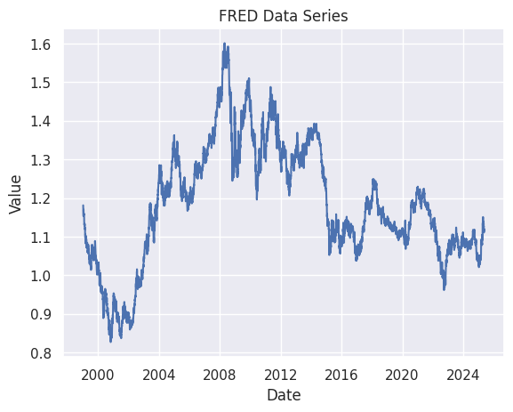
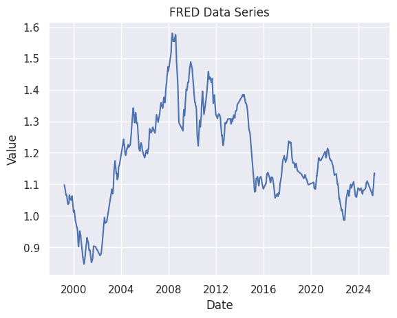
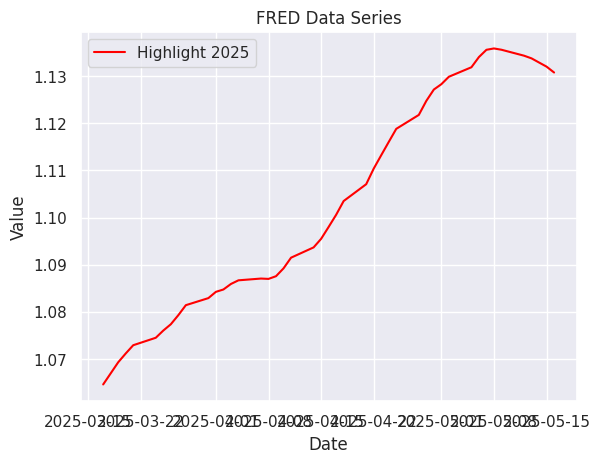

```python
from fredapi import Fred
import pandas as pd
import seaborn as sns
import keys
import statsmodels.api as sm
import statsmodels.formula.api as smf

```


```python
fred = Fred(keys.api_key)
data = fred.get_series('DEXUSEU')

data = pd.DataFrame(data)
print(data.tail())

```

                     0
    2025-05-12  1.1106
    2025-05-13  1.1176
    2025-05-14  1.1206
    2025-05-15  1.1189
    2025-05-16  1.1141
    


```python
sns.set_theme(style="darkgrid")

sns.lineplot(data=data.reset_index(), x='index', y=0).set(title='FRED Data Series', xlabel='Date', ylabel='Value')
```


    [Text(0.5, 1.0, 'FRED Data Series'),
     Text(0.5, 0, 'Date'),
     Text(0, 0.5, 'Value')]


    

    


```python
window_size = 20
rolling_avg = data.rolling(window=window_size).mean()

sns.lineplot(data=rolling_avg.reset_index(), x='index', y=0).set(title='FRED Data Series', xlabel='Date', ylabel='Value')
```


    [Text(0.5, 1.0, 'FRED Data Series'),
     Text(0.5, 0, 'Date'),
     Text(0, 0.5, 'Value')]


    

    


```python
highlight_year = '2025'
highlight_data = rolling_avg.loc[highlight_year]

sns.lineplot(data=highlight_data.reset_index(), x='index', y=0, label=f'Highlight {highlight_year}', color='red').set(title='FRED Data Series', xlabel='Date', ylabel='Value')


```


    [Text(0.5, 1.0, 'FRED Data Series'),
     Text(0.5, 0, 'Date'),
     Text(0, 0.5, 'Value')]


    

    


```python
# I am working on this regression it is not predictive of nothing other that I know how to operate the function.
# Drop rows with missing values in the 'Value' column
data_cleaned = data.dropna(subset=['Value'])

# Fit the model
model = sm.OLS(data_cleaned['Value'], sm.add_constant(data_cleaned['Time']))
results = model.fit()

# Print the summary of the regression results
print(results.summary())

```

                                OLS Regression Results                            
    ==============================================================================
    Dep. Variable:                  Value   R-squared:                       0.001
    Model:                            OLS   Adj. R-squared:                  0.001
    Method:                 Least Squares   F-statistic:                     4.320
    Date:                Mon, 19 May 2025   Prob (F-statistic):             0.0377
    Time:                        23:30:37   Log-Likelihood:                 2935.1
    No. Observations:                6615   AIC:                            -5866.
    Df Residuals:                    6613   BIC:                            -5853.
    Df Model:                           1                                         
    Covariance Type:            nonrobust                                         
    ==============================================================================
                     coef    std err          t      P>|t|      [0.025      0.975]
    ------------------------------------------------------------------------------
    const          1.1763      0.004    308.529      0.000       1.169       1.184
    Time        1.998e-06   9.61e-07      2.078      0.038    1.14e-07    3.88e-06
    ==============================================================================
    Omnibus:                       94.765   Durbin-Watson:                   0.002
    Prob(Omnibus):                  0.000   Jarque-Bera (JB):               66.527
    Skew:                           0.134   Prob(JB):                     3.58e-15
    Kurtosis:                       2.588   Cond. No.                     7.92e+03
    ==============================================================================
    
    Notes:
    [1] Standard Errors assume that the covariance matrix of the errors is correctly specified.
    [2] The condition number is large, 7.92e+03. This might indicate that there are
    strong multicollinearity or other numerical problems.
    

Source: Board of Governors of the Federal Reserve System (US)  Release: H.10 Foreign Exchange Rates  
Units:  U.S. Dollars to One Euro, Not Seasonally Adjusted

Frequency:  Daily

Notes:
Noon buying rates in New York City for cable transfers payable in foreign currencies.

Suggested Citation:
Board of Governors of the Federal Reserve System (US), U.S. Dollars to Euro Spot Exchange Rate [DEXUSEU], retrieved from FRED, Federal Reserve Bank of St. Louis; https://fred.stlouisfed.org/series/DEXUSEU, May 19, 2025.
